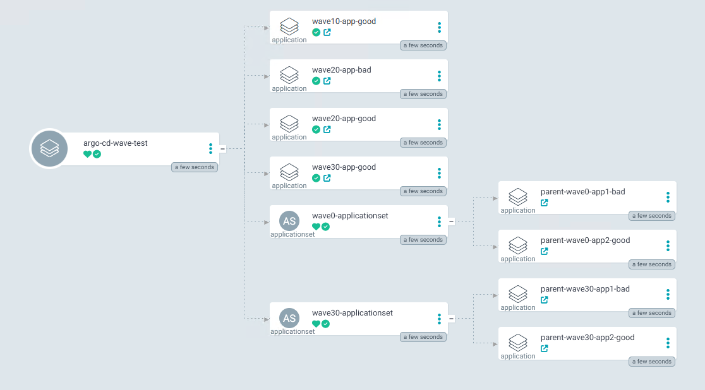
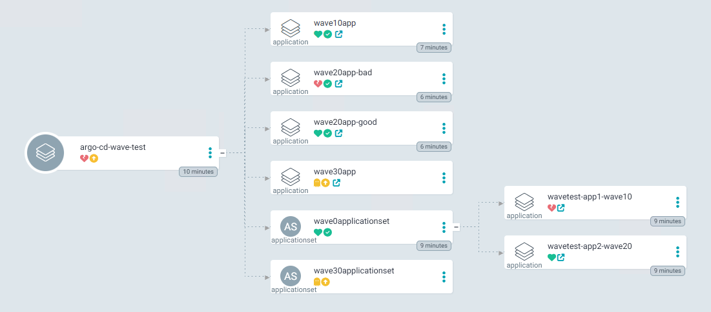

# ArgoCD Sync-Wave Demo

The health assessment of Application CRD has been removed in version 1.8. If you want to use the app-of-app pattern in your project, you need to understand the following implications.

## Unpatched

- All Application CRs are always in the healthy state if the child is also an application.
- Sync-Wave configurations in Applications do not take effect in terms of waiting.
- The Sync-Wave order only pauses the default configured wave-to-wave duration.

## Patched

- Application CRs get the health state from there childrens.
- Sync-Wave configurations in Applications take effect in term of waiting.
- An errored wave blocks the following waves.
